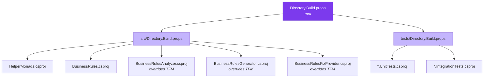

# Build Infrastructure

## Overview

The solution uses a layered MSBuild property hierarchy to enforce consistency across all projects while allowing targeted overrides for specialized components (Roslyn analyzers/generators).

## Directory.Build.props Hierarchy



Each nested `Directory.Build.props` imports its parent via:

```xml
<Import Project="$([MSBuild]::GetPathOfFileAbove('Directory.Build.props', '$(MSBuildThisFileDirectory)../'))" />
```

### Root — `Directory.Build.props`

Applies to **every project** in the solution. Sets:

| Property | Value | Purpose |
|----------|-------|---------|
| `Version` | `0.0.1` | Package version (single source of truth) |
| `Authors` | Mauro Verberkt | NuGet metadata |
| `Copyright` | Copyright (c) Mauro Verberkt | NuGet metadata |
| `RepositoryUrl` | GitHub URL | Package source link |
| `PackageLicenseExpression` | MIT | License for all packages |
| `TargetFramework` | net8.0 | Default TFM (overridden by Roslyn projects) |
| `LangVersion` | latest | Always use newest C# features |
| `ImplicitUsings` | enable | Reduce boilerplate usings |
| `Nullable` | enable | Nullable reference types everywhere |
| `TreatWarningsAsErrors` | true | Zero-warning policy |

### Source — `src/Directory.Build.props`

Applies to all source projects. Adds:

| Property | Value | Purpose |
|----------|-------|---------|
| `GenerateDocumentationFile` | true | XML docs for IntelliSense and NuGet |
| `PackageReadmeFile` | README.md | NuGet gallery display (packable projects only) |

### Tests — `tests/Directory.Build.props`

Applies to all test projects. Sets:

| Property/Item | Purpose |
|---------------|---------|
| `IsPackable=false` | Tests are never packaged |
| `IsTestProject=true` | Enables test discovery |
| Common NUnit packages | Single place to update test infrastructure versions |
| `<Using Include="NUnit.Framework"/>` | Global using for all test files |

## Roslyn Project Inheritance

Analyzer and generator projects target `netstandard2.0` (required for Roslyn host compatibility) but inherit everything else from the root:

```xml
<!-- In BusinessRulesAnalyzer.csproj -->
<PropertyGroup>
  <TargetFramework>netstandard2.0</TargetFramework>  <!-- Override root's net8.0 -->
  <EnforceExtendedAnalyzerRules>true</EnforceExtendedAnalyzerRules>
  <IsRoslynComponent>true</IsRoslynComponent>
</PropertyGroup>
```

What they **inherit** from root: `LangVersion`, `ImplicitUsings`, `Nullable`, `TreatWarningsAsErrors`, `Version`, `Authors`, etc.

What they **override**: Only `TargetFramework`.

## Central Package Management

All NuGet package versions are defined in `Directory.Packages.props` at the repo root. Individual project files declare which packages they need **without** specifying versions:

```xml
<!-- Directory.Packages.props (centralized) -->
<PackageVersion Include="NUnit" Version="4.2.2" />

<!-- Any test .csproj (no version) -->
<PackageReference Include="NUnit" />
```

### Adding a New Package

1. Add `<PackageVersion Include="PackageName" Version="X.Y.Z" />` to `Directory.Packages.props`
2. Add `<PackageReference Include="PackageName" />` to the project that needs it

### Updating a Package Version

1. Change the version in `Directory.Packages.props` — all consuming projects pick it up automatically

### Package Groups

The `Directory.Packages.props` is organized into logical sections:

- **Roslyn / Source Generators** — `Microsoft.CodeAnalysis.*`, `System.Text.Json`
- **Runtime dependencies** — `System.ServiceModel.Primitives`
- **Test infrastructure** — NUnit, TestSdk, coverlet, Moq, testing helpers

## Compiler Settings

### TreatWarningsAsErrors

Enabled globally in the root props. This enforces a zero-warning policy — any warning becomes a build failure. This catches:

- Nullable reference type violations
- Unused variables/parameters
- Missing XML documentation on public APIs (in src projects)
- Obsolete API usage
- Platform compatibility issues

### Nullable Reference Types

Enabled for **all** projects including `netstandard2.0` Roslyn components. The compiler synthesizes the required attributes for netstandard2.0 targets automatically.

## Adding a New Project

### New source library

1. Create `src/NewProject/NewProject.csproj` with just project-specific settings
2. It automatically inherits: TFM, language settings, nullable, warnings-as-errors, doc generation
3. If packable, add `<IsPackable>true</IsPackable>` and package metadata (`PackageId`, `Title`, `Description`, `PackageTags`)

### New Roslyn analyzer/generator

1. Create the csproj with `<TargetFramework>netstandard2.0</TargetFramework>` override
2. Add `<EnforceExtendedAnalyzerRules>true</EnforceExtendedAnalyzerRules>` and `<IsRoslynComponent>true</IsRoslynComponent>`
3. Everything else is inherited

### New test project

1. Create `tests/NewProject.Tests/NewProject.Tests.csproj`
2. It automatically inherits: `IsPackable=false`, `IsTestProject=true`, all NUnit packages, global using
3. Only add project-specific references and any extra packages needed