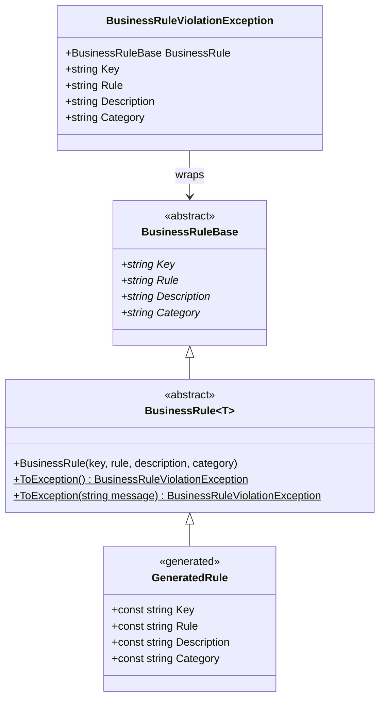
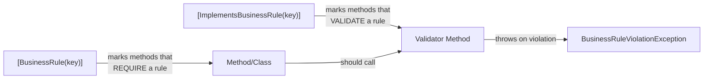

# BusinessRules Runtime Design

## Component Overview

The runtime library provides the foundation that generated code builds upon: base classes, attributes for marking code, a resolver for runtime lookup, and a structured exception model.

## Class Hierarchy



## CRTP Pattern

`BusinessRule<T>` uses the Curiously Recurring Template Pattern:

```csharp
public abstract class BusinessRule<T> : BusinessRuleBase
    where T : BusinessRule<T>, new()
```

The `new()` constraint enables static factory methods that create instances of the derived type:

```csharp
// Inside BusinessRule<T>:
public static BusinessRuleViolationException ToException()
{
    var instance = new T();  // Creates the concrete derived type
    return new BusinessRuleViolationException(instance);
}
```

**Call site result:** `throw UserMustBeAdult.ToException();` - no instantiation needed by the caller.

## Attribute Model

Two attributes govern how business rules are associated with code:



| Attribute | Purpose | Analyzer |
|-----------|---------|----------|
| `[BusinessRule(key)]` | Declares a method/class is governed by a rule | BR002 ensures a validator exists |
| `[ImplementsBusinessRule(key)]` | Declares a method implements the validation logic | BR004 checks throw is inside here |

Both attributes resolve the `BusinessRuleBase` instance at construction time via `BusinessRuleResolver`.

## BusinessRuleResolver

A static utility providing runtime discovery of business rules through reflection:

```csharp
public static class BusinessRuleResolver
{
    public static BusinessRuleBase? FindBusinessRuleByKey(string key)
    {
        // Searches all loaded assemblies for static fields
        // of type BusinessRuleBase with a matching key
    }
}
```

**When used:** At attribute construction time to resolve the rule key into a full `BusinessRuleBase` instance. This provides runtime access to rule metadata (description, category) from attributes.

**Trade-off:** This is the only place reflection is used. It runs once per attribute instance (typically at application startup during type loading).

## Exception Model

```csharp
public class BusinessRuleViolationException : Exception
{
    public BusinessRuleBase BusinessRule { get; }
    public string Key => BusinessRule.Key;
    public string Requirement => BusinessRule.Requirement;
    public string Description => BusinessRule.Description;
    public string Category => BusinessRule.Category;
}
```

The exception carries the full rule context, enabling:
- Structured logging with rule metadata
- Client-friendly error responses with rule key and description
- Conversion to WCF faults (via `BusinessRules.Wcf`)
- Conversion to `Result<T>` failures (via `BusinessRules.ResultExtensions`)

## Serialization Support

`BusinessRuleBase` is decorated with `[DataContract]` and internal properties use `[DataMember]`, supporting:
- WCF fault transmission across service boundaries
- Potential JSON serialization for API responses
- Any `DataContractSerializer`-based scenario

## InternalsVisibleTo

The `BusinessRules` assembly grants internal access to:
- `BusinessRules.Wcf` - needs access to internal properties (Key, Rule, etc.) for fault construction
- Test projects - for testing internal behavior

This keeps the public API surface minimal while allowing extension packages to work with internals.
