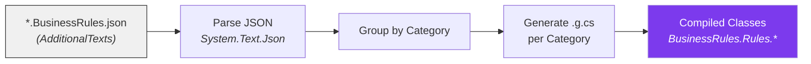
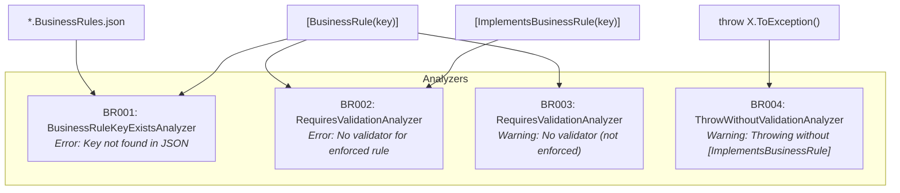

# BusinessRules Tooling Design

## Overview

The tooling layer provides compile-time code generation and validation. It consists of three components that work together:

1. **BusinessRulesGenerator** - Reads JSON, produces C# classes
2. **BusinessRulesAnalyzer** - Validates correct usage at compile time
3. **BusinessRulesFixProvider** - Offers automatic code fixes for violations

All three target `netstandard2.0` for maximum host compatibility.

## Source Generator Pipeline



### Generator Implementation

```csharp
[Generator]
public class BusinessRuleSourceGenerator : IIncrementalGenerator
{
    public void Initialize(IncrementalGeneratorInitializationContext context)
    {
        // 1. Filter to BusinessRules.json files
        var jsonFiles = context.AdditionalTextsProvider
            .Where(file => file.Path.EndsWith("BusinessRules.json"));

        // 2. Parse JSON content (cached - only re-runs on file change)
        var rules = jsonFiles.Select((file, ct) => ParseJson(file, ct));

        // 3. Generate source for each category
        context.RegisterSourceOutput(rules, GenerateSource);
    }
}
```

### Generated Output

For each rule in JSON:
```json
{ "className": "UserMustBeAdult", "key": "USER_AGE_MIN", "rule": "...", "category": "UserValidation" }
```

The generator produces:
```csharp
// <auto-generated />
namespace BusinessRules.Rules.UserValidation;

public class UserMustBeAdult() : BusinessRule<UserMustBeAdult>(Key, Rule, Description, Category)
{
    public const string Key = "USER_AGE_MIN";
    public const string Rule = "User must be at least 18 years old";
    public const string Description = "...";
    public const string Category = "UserValidation";
}
```

### System.Text.Json Bundling

Since the generator targets `netstandard2.0` (which doesn't include `System.Text.Json`), it's bundled as a private dependency:

```xml
<PackageReference Include="System.Text.Json" Version="..." GeneratePathProperty="true" PrivateAssets="all" />
```

A custom MSBuild target (`GetDependencyTargetPaths`) ensures the DLL is available when the analyzer host loads the generator assembly.

## Roslyn Analyzers



### BR001: BusinessRuleKeyExistsAnalyzer

**Severity:** Error

**Triggers when:** A `[BusinessRule]` or `[ImplementsBusinessRule]` attribute references a key that doesn't exist in any `*.BusinessRules.json` file.

**Implementation:** Reads all `AdditionalTexts` JSON files at `CompilationStart`, builds a set of valid keys, then checks every attribute usage.

### BR002 / BR003: RequiresValidationAnalyzer

**Severity:** BR002 = Error, BR003 = Warning

**Triggers when:** A method has `[BusinessRule(key, enforceValidation: true)]` (BR002) or `[BusinessRule(key, enforceValidation: false)]` (BR003) but no method anywhere in the compilation has `[ImplementsBusinessRule(key)]`.

**Implementation:** Uses `ConcurrentDictionary` to collect all `[BusinessRule]` usages and `[ImplementsBusinessRule]` declarations during syntax analysis. At `CompilationEnd`, reports diagnostics for unmatched rules.

### BR004: ThrowWithoutValidationAnalyzer

**Severity:** Warning

**Triggers when:** Code calls `.ToException()` on a `BusinessRule<T>` type and the containing method does NOT have `[ImplementsBusinessRule]`.

**Purpose:** Encourages proper attribution - business rule exceptions should only be thrown inside designated validator methods.

## Code Fix Provider

### ThrowWithoutValidationCodeFixProvider

**Fixes:** BR004

**Action:** Automatically adds `[ImplementsBusinessRule(ClassName.Key)]` to the containing method, including:
- The attribute itself
- A `using` directive for the rule's namespace (if not already present)

**Implementation:**
```csharp
// Finds the method containing the diagnostic
// Adds the attribute using SyntaxFactory
// Adds the using directive if needed
```

## Thread Safety

The analyzers use `ConcurrentDictionary` and `ConcurrentBag` for collecting data across parallel syntax node visits:

- Multiple threads visit syntax nodes simultaneously
- Data is collected into thread-safe collections
- `CompilationEnd` action runs after all visits complete and produces final diagnostics

This is required because Roslyn may call `RegisterSyntaxNodeAction` callbacks from multiple threads concurrently.

## Testing Strategy

Analyzer and generator tests use Microsoft's official test infrastructure:

```csharp
// Analyzer test
await new CSharpAnalyzerTest<BusinessRuleKeyExistsAnalyzer, NUnitVerifier>
{
    TestCode = "...",
    AdditionalFiles = { ("Test.BusinessRules.json", jsonContent) },
    ExpectedDiagnostics = { DiagnosticResult.CompilerError("BR001").WithLocation(5, 20) }
}.RunAsync();
```

This provides:
- In-memory compilation with the analyzer applied
- Verification of expected diagnostics at specific locations
- Testing the full pipeline without file I/O
