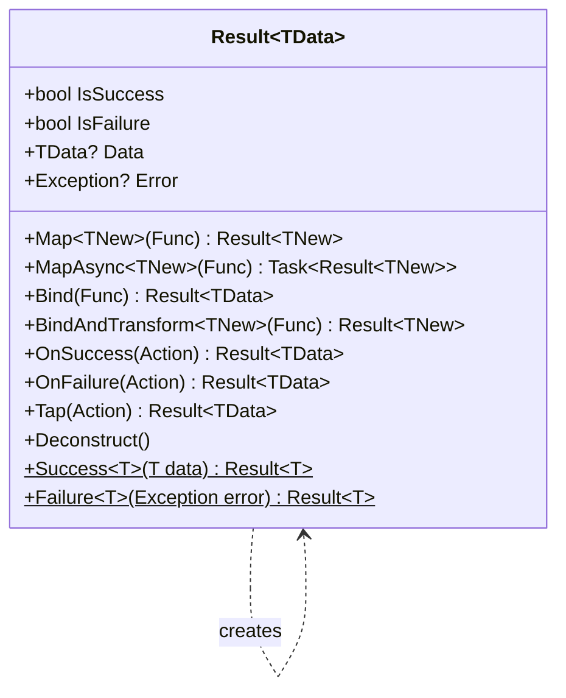
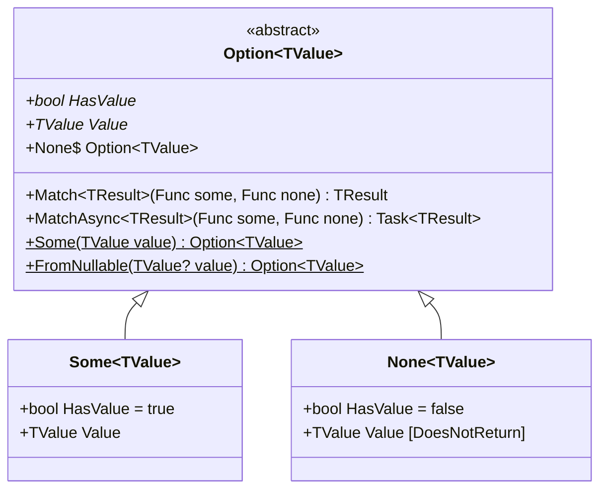

# HelperMonads Design

## Package Overview

HelperMonads provides two monadic types: `Result<TData>` for fallible operations and `Option<TValue>` for optional values. Both are designed for composition and null safety.

## Result&lt;T&gt; Class Hierarchy



### Construction Model

`Result<TData>` uses a **sealed-construction** pattern:

- The constructor is `private` (hidden with `[EditorBrowsable(Never)]`)
- Instances are created only through the non-generic `Result` static factory class
- This ensures the invariants are always valid (Success has Data, Failure has Error)

```csharp
// The ONLY ways to create a Result:
var success = Result.Success(data);      // IsSuccess=true, Data=data, Error=null
var failure = Result.Failure<T>(error);  // IsSuccess=false, Data=null, Error=error
```

### Method Chaining Model

Methods follow a consistent pattern for composition:

| Category | Methods | Behavior on Failure |
|----------|---------|-------------------|
| **Transform** | `Map`, `MapAsync` | Pass through failure unchanged |
| **Chain** | `Bind`, `BindAndTransform`, `BindAsync`, `BindAndTransformAsync` | Pass through failure unchanged |
| **Side effects** | `OnSuccess`, `OnFailure`, `Tap` | Execute conditionally, return `this` |
| **Destructure** | `Deconstruct` | Returns all three components |

All transform/chain methods **short-circuit on failure** - the function is never called if the Result is already failed.

### Async Patterns

Every transformation method has an async counterpart with `CancellationToken` support:

```csharp
// Sync
result.Map(user => user.Name);

// Async
await result.MapAsync(async user => await LoadProfileAsync(user));

// Async with cancellation
await result.MapAsync(async (user, ct) => await LoadProfileAsync(user, ct), cancellationToken);
```

### Equality

`Result<TData>` implements `IEquatable<Result<TData>>`. Two results are equal if:
- Both are success with equal Data, OR
- Both are failure with equal Error references

## Option&lt;T&gt; Class Hierarchy



### Inheritance Model

Unlike Result (which uses a factory), Option uses **inheritance**:

- `Some<TValue>` - holds the value, `HasValue` returns `true`
- `None<TValue>` - represents absence, `HasValue` returns `false`, `Value` getter has `[DoesNotReturn]` and throws `OptionIsNoneException`

### Implicit Conversions

```csharp
// Nullable to Option (implicit)
string? nullable = null;
Option<string> option = nullable;  // becomes None

string? present = "hello";
Option<string> option = present;   // becomes Some("hello")
```

### Pattern Matching

The primary consumption API is `Match`, forcing callers to handle both cases:

```csharp
string result = option.Match(
    some: value => $"Got: {value}",
    none: () => "Nothing"
);
```

This is safer than checking `.HasValue` + `.Value` because the compiler ensures both paths are handled.

## Design Trade-offs

| Decision | Trade-off |
|----------|-----------|
| Result uses factory, Option uses inheritance | Result can be a single class (simpler); Option needs polymorphic dispatch for Match |
| Private constructor on Result | Prevents invalid states but requires factory pattern knowledge |
| `[DoesNotReturn]` on None.Value | Clear intent but accessing Value on None still compiles (throws at runtime) |
| CancellationToken overloads on all async methods | Complete API but doubles the method count |
| `IEquatable` on Result only | Result equality is well-defined; Option equality is trickier with reference types |
