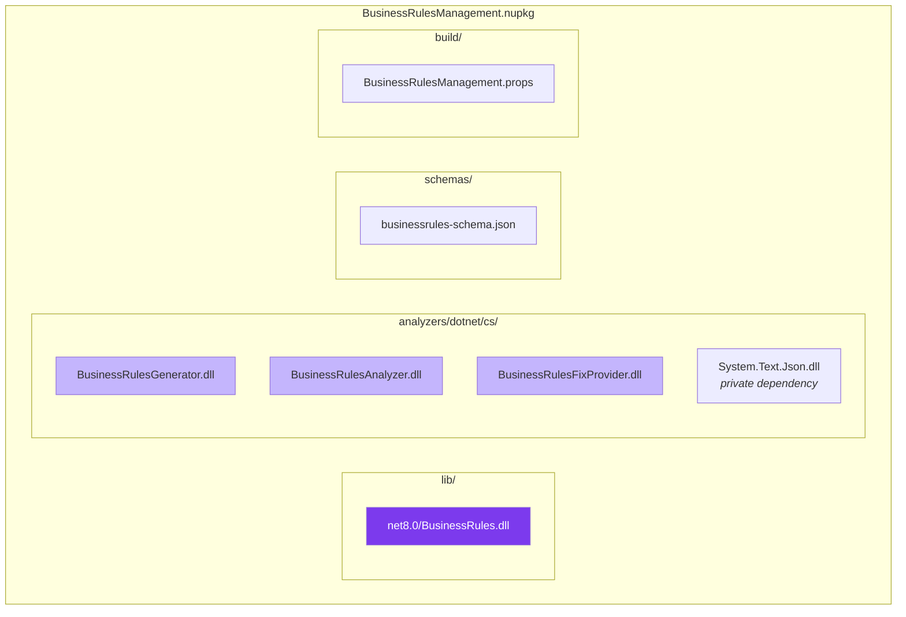
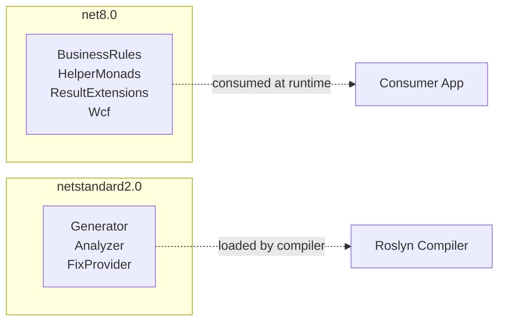

# Package Structure

## Overview

DotnetHelpers ships as two primary NuGet packages, each with specific internal layouts to support runtime code, analyzers, and build integration.

## HelperMonads Package

Simple library package - no analyzers or generators:

```
HelperMonads.nupkg
└── lib/
    └── net8.0/
        └── HelperMonads.dll
```

## BusinessRulesManagement Package

Complex package combining runtime library, source generator, analyzers, fix provider, schema, and build props:



### Layout Explanation

| Path | Content | Purpose |
|------|---------|---------|
| `lib/net8.0/` | BusinessRules.dll | Runtime library consumed by user code |
| `analyzers/dotnet/cs/` | Generator + Analyzer + FixProvider DLLs | Loaded by the compiler during build |
| `analyzers/dotnet/cs/` | System.Text.Json.dll | Private dependency for the generator (netstandard2.0 needs it) |
| `schemas/` | businessrules-schema.json | JSON schema for IntelliSense in JSON editors |
| `build/` | BusinessRulesManagement.props | MSBuild props imported by consuming projects |

## How Analyzers Are Packed

The `BusinessRules.csproj` references the tooling projects with special attributes:

```xml
<ProjectReference Include="..\BusinessRulesAnalyzer\BusinessRulesAnalyzer.csproj"
                  OutputItemType="Analyzer"
                  ReferenceOutputAssembly="false" />
```

| Attribute | Effect |
|-----------|--------|
| `OutputItemType="Analyzer"` | Places the DLL in `analyzers/dotnet/cs/` in the package |
| `ReferenceOutputAssembly="false"` | Does NOT add a compile-time reference to the runtime project |

This means:
- The analyzer DLLs are included in the package but NOT referenced by BusinessRules.dll at compile time
- Consuming projects get the analyzers loaded by the compiler automatically
- The runtime library and tooling are completely decoupled at build time

## System.Text.Json Bundling

The generator needs `System.Text.Json` to parse the JSON files, but targets `netstandard2.0` which doesn't include it. Solution:

```xml
<!-- In BusinessRulesGenerator.csproj -->
<PackageReference Include="System.Text.Json"
                  GeneratePathProperty="true"
                  PrivateAssets="all" />

<Target Name="GetDependencyTargetPaths">
  <ItemGroup>
    <TargetPathWithTargetPlatformMoniker
      Include="$(PkgSystem_Text_Json)\lib\netstandard2.0\System.Text.Json.dll"
      IncludeRuntimeDependency="false" />
  </ItemGroup>
</Target>
```

`GeneratePathProperty="true"` creates a `$(PkgSystem_Text_Json)` MSBuild property pointing to the NuGet cache path. The custom target ensures the DLL is copied alongside the generator so the analyzer host can load it.

## Target Framework Strategy



| Target | Used By | Reason |
|--------|---------|--------|
| `net8.0` | Runtime libraries | Access to latest C# features, nullable annotations |
| `netstandard2.0` | Tooling (analyzers, generators) | Required for compatibility with all Roslyn hosts (VS, Rider, CLI on any .NET version) |

## Build Configuration

### Schema Distribution

The JSON schema enables IntelliSense when editing `*.BusinessRules.json` files:

```xml
<None Include="schemas\businessrules-schema.json" Pack="true" PackagePath="schemas\" />
```

Consumers reference it in their JSON:
```json
{
  "$schema": "../schemas/businessrules-schema.json",
  "businessRules": [...]
}
```

### MSBuild Props

The `build/BusinessRulesManagement.props` file is automatically imported by consuming projects (NuGet convention). It can set defaults like:
- Adding the schema to known JSON schemas
- Configuring analyzer severity defaults
- Setting up AdditionalFiles patterns

## Extension Packages

Both extension packages are simple library packages:

```
BusinessRules.ResultExtensions.nupkg       BusinessRules.Wcf.nupkg
└── lib/                                   └── lib/
    └── net8.0/                                └── net8.0/
        └── BusinessRules.ResultExtensions.dll     └── BusinessRules.Wcf.dll
```

They declare package dependencies on their prerequisites:
- `ResultExtensions` depends on: `HelperMonads`, `BusinessRulesManagement`
- `Wcf` depends on: `BusinessRulesManagement`, `System.ServiceModel.Primitives`
