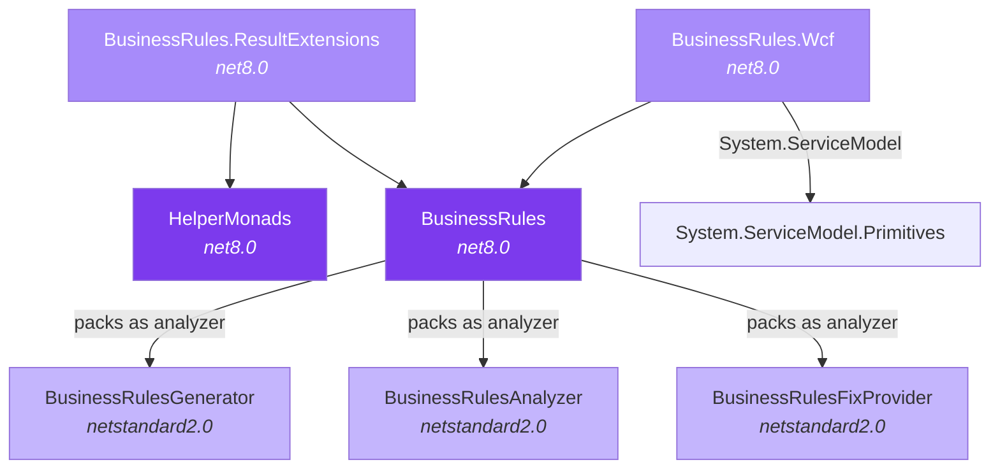

# Architecture Overview

DotnetHelpers is composed of independent, composable libraries connected by optional integration packages.

## Design Principles

- **Independence**: Core libraries (HelperMonads, BusinessRules) have zero dependencies on each other
- **Opt-in integration**: Glue libraries (ResultExtensions, Wcf) bridge concerns only when needed
- **Compile-time safety**: Source generators and Roslyn analyzers catch errors before runtime
- **Zero runtime cost**: Generated code, not reflection, for hot paths

## Project Dependency Graph

## Package Summary

| Package | Target | Purpose |
|---------|--------|---------|
| **HelperMonads** | net8.0 | `Result<T>` and `Option<T>` monadic types |
| **BusinessRules** | net8.0 | Runtime base classes, attributes, exception model |
| **BusinessRulesGenerator** | netstandard2.0 | Source generator: JSON to strongly-typed rule classes |
| **BusinessRulesAnalyzer** | netstandard2.0 | Roslyn analyzers (BR001-BR004) for compile-time validation |
| **BusinessRulesFixProvider** | netstandard2.0 | Code fix provider for analyzer diagnostics |
| **BusinessRules.ResultExtensions** | net8.0 | Bridges BusinessRules + HelperMonads Result pattern |
| **BusinessRules.Wcf** | net8.0 | WCF fault exception support (legacy systems) |

## Test Projects

| Project | Tests |
|---------|-------|
| HelperMonads.UnitTests | Result and Option behavior, Moq for mocking |
| BusinessRules.UnitTests | Analyzer/generator verification using Roslyn test infrastructure |
| BusinessRules.IntegrationTests | End-to-end: JSON file to generated code to analyzer validation |
| BusinessRules.ResultExtensions.UnitTests | Extension method behavior |
| BusinessRules.Wcf.UnitTests | Fault exception creation |

## Key Architectural Decisions

See the [Decisions (ADRs)](./decisions/001-result-over-exceptions.md) section for detailed records of each major design choice, including:

- Why Result pattern over exceptions
- Why source generators (not reflection)
- Why WCF and ResultExtensions are separate packages
- Why CRTP for business rule static factories
- Why incremental generators over the legacy API

## Component Design

See the [Design](./design/helper-monads.md) section for detailed documentation of internal structure:

- [HelperMonads](./design/helper-monads.md) - Class hierarchies, method chaining model
- [BusinessRules Runtime](./design/business-rules-runtime.md) - Base classes, attributes, resolver
- [BusinessRules Tooling](./design/business-rules-tooling.md) - Generator pipeline, analyzers, fix provider
- [Package Structure](./design/package-structure.md) - NuGet layout, analyzer packing strategy
